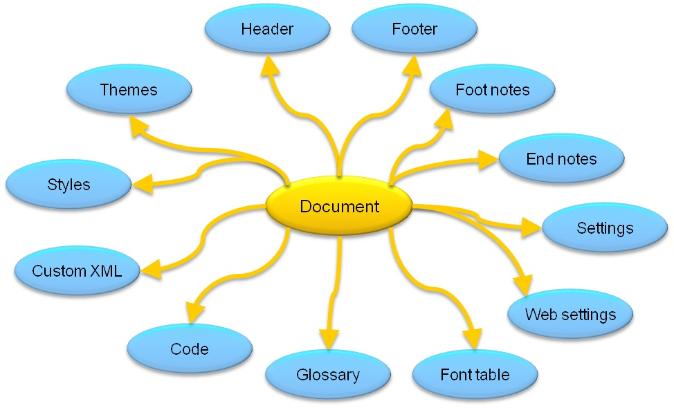

# Structure of a WordprocessingML document
A WordprocessingML document is a part of the Open XML Format which powers some famously known file formats such as `.docx`, `pptx`, `.doc`, etc...

This specific Section of Notes is in relation to the Open XML library that I'm utilizing in C# for `.docx` serial and deserialization. Which can be found [here](https://github.com/Zack-byte/Docx-Serializer) on my github.

The basic document structure of a **WordprocessingML** document consists of the `<document>` and `<body>` elements, followed by one or more block level elements such as `<p>`, which represents a paragraph. A paragraph contains one or more `<r>` elements. The `<r>` stands for run, which is a region of text with a common set of properties, such as formatting. A run contains one or more `<t>` elements. The `<t>` element contains a range of text.

## Important Parts
The Open XML API provides strongly-typed classes in the DocumentFormat.OpenXNL.WordprocessingML namespace that correspond to WordprocessingML elements.

This table lists some important elements...
| Package Part |WordprocessingML Element|Class | Description |
|---|---|---|---|
| Main Document | document | Document | The root element for the main document part. 
| Comments | comments | Comments | The root element for the comments part. |
| Document Settings | settings | Settings | The root element for the document settings part. |
| Endnotes | endnotes | Endnotes | The root element for the endnotes part. |
| Footer | ftr | Footer | The root element for the footer part. |
| Footnotes | footnotes | Footnotes | The root element for the footnotes part. |
| Glossary Document | glossaryDocument | GlossaryDocument | The root element for the glossary document part. |
| Header | hdr | Header | The root element for the header part. |
| Style Definitions | styles | Styles | The root element for a Style Definitions part.

## Minimum Document Scenario
A document is organized around the concept of stories. A story is a region of content in a document. 

Stories include: 
- comment
- endnote
- footer
- footnote
- frame, glossary document
- header
- main story
- subdocument
- text box 


Not all stories must be present in a valid document. The simplest, valid document only requires a single story---the main document story. The main document story is represented by the main document part. At a minimum, to create a valid document using code, add a main document part to the document.

The (ISO/IEC 29500)[https://www.iso.org/iso/iso_catalogue/catalogue_tc/catalogue_detail.htm?csnumber=51463] introduces the elements required in the main document part in order to complete the minimum document scenario.

**THESE ARE**
- `document`: The root element for a main document part, which defines the main document story.
- `body`: The container for the collection of block-level structures that comprise the main story.
- `p`: A paragraph.
- `r`: A run.
- `t`: A range of text.

```C#
// Creates a Hello World WordprocessingML document
public static void CreateWordDoc(string filepath, string msg)
{
    using (WordprocessingDocument doc = WordprocessingDocument.Create(filepath, DocumentFormat.OpenXML.WordprocessingDocumentType.Document))
    {
        // Add a main document part.
        MainDocumentPart mainPart = doc.AddMainDocumentPart();

        // Create the document structure and add some text.
        mainPart.Document = new Document();
        Body body = mainPart.Document.AppendChild(new Body());
        Paragraph para = body.AppendChild(new Paragraph());
        Run run = para.AppendChild(new Run());

        // String msg contains the text, "Hello, Word!"
        run.AppendChild(new Text(msg));
    }
}
```
The code above will generate a .docx at the specified `filePath`. All .docx files are actually just renamed `zip archives` which can be renamed and extracted by anyone. If you do so you will find the document xml to look something like this.
```xml
    <?xml version="1.0" encoding="utf-8"?>
    <w:document xmlns:w="https://schemas.openxmlformats.org/wordprocessingml/2006/main">
      <w:body>
        <w:p>
          <w:r>
            <w:t>Hello, Word!</w:t>
          </w:r>
        </w:p>
      </w:body>
    </w:document>
```

## Typical Document Scenario
Typical documents will be filled with variation. Meaning they can carry lots of other different elements such as seen below.

