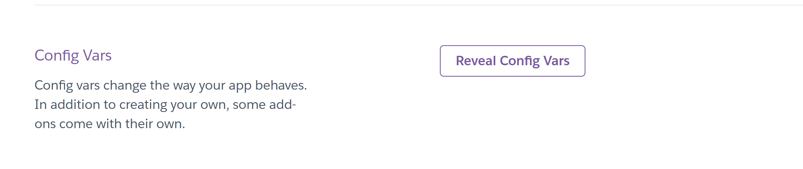
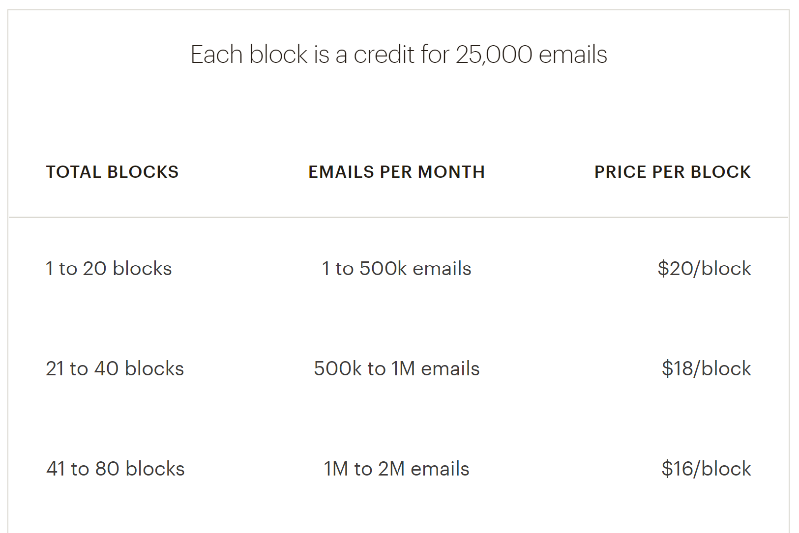

# Setting up Unfunded with Mailchimp
These notes follow a non-profit app smtp sending provider transition from `Mail Gun` (Old) to `Mail Chimp` (New). The App in question utilizes `Vue`, `Django`, and `Postgress` for its codebase, and of course has pre-existing code for sending emails via `Mail Gun`.

## Setting Up MailChimp for testing
The `Unfunded` site itself has a Staging and Production environment. For obvious reasons I'll be cutting over in the Staging environment first before making any changes in Production. `Mail Chimp` integrates sending smtp email through its `Transactional API`. If you have a `Standard Plan` or above you can enable this in the "Monthly plans or credits" page of your account.

After some guided setup you'll then have access to the `Mandrill` app which is a dashboard that has everything you'll need moving forward.

## Generate Your API Key
Now you have two options, you can generate an actual API Key or you can generate a `Test API Key` to be able to send via the Test API's. For staging environment purposes I'll be using this. 

To generate a test API Key:
1. Click `+ Add Key`
2. Input a key description
3. check the `Test Key` checkbox

Once you've created a test API you should switch `Mandrill` to the testing dashboard which you can do by clicking your user name in the `Top Right` and then `Enter Test Mode`.

## Set up or Authenticate your Domain
Authentication is a way to prove an email isn't forged. Mailchimp Transactional automatically authenticates all emails sent through their servers, but by adding DNS records to your domain, they're able to send on your behalf and digitally "sign" your emails.

Many ISPs use authentication to track sending reputation, and since authentication is handled by your domain, you maintain some control over the emails that affect deliverability for that domain. A positive reputation builds trust and improves deliverability, reducing the chance that your emails are caught by spam filters and improving how quickly the receiving servers will accept mail from your domain. 

You'll need to add `Sender Policy Framework` and `Domain Keys Identified Mail` records and verify ownership of your sending domains before you can send email through your account. Mailchimp Transactional will not send any email from unverified domains or domains without valid SPF and DKIM records.

A message that is rejected as `unsigned` indicates that the sending domain hasn't been properly set up, and that your account is unable to authenticate and send email from that domain. Verifying a domain prevents other Mailchimp Transactional users from sending from your domain unless they also complete the verification process.

Unfunded list's current domain is `unfundedlist.com` with subdomain `mg` however for testing and personal understanding I purchased a new domain and create an email address on the domain.
- Domain Name = `mc-unfundedlist.com`
- Domain Email = `zackharris@mc-unfundedlist.com`

Once you got these setup you'll need to add the new domain in `Mandrill` as well as flesh out proof of domain ownership.
You can do this with three things

- First being a verification email that is sent to an email on the domain mine being `zackharris@mc-unfundedlist.com`
- Second is DKIM which you can set up by going back to `MailChimp -> Domains -> Manage Domain -> Advanced DNS Settings` and adding a new `TXT` Record with the specified name and value provided in `Mandrill` when you click on `Domains -> View DKIM settings`
- Lastly is adding another `TXT` record and filling out the appropriate `Name` and `Value` fields provided under the `Mandrill -> Domains -> View SPF settings`

Now we can move on to the Code

## Project Config
Before we start making API calls to send email we need to set up some items in our django environment config. 

When running in development mode locally you can specify these in your `.env` file in the root of your project. Usually if your project is running on a hosting platform there will be a way to securely add env variables via a GUI. Unfunded uses `heroku` for both its staging and production so when we push our changes to staging we will make sure to...
1. Remove any values we hardcoded in our `.env` file
2. Add those values under `heroku -> PROJECT_NAME -> Settings -> Config Vars`

This allows for our secrets to remain safe and follow best development practices by NOT hardcoding them.

### Locally
In our `.env` file we need to add three variables
```python
# Mailchimp Credentials
MAILCHIMP_API_KEY=''
MAILCHIMP_DOMAIN=''
MAILCHIMP_TEST_EMAIL=''
```

In our `Django` `settings.py` we need to set our project variables to key off of our environment variables
```python
# Mailchimp Configuration
MAILCHIMP_API_KEY = os.environ.get('MAILCHIMP_API_KEY', '')
MAILCHIMP_DOMAIN = os.environ.get('MAILCHIMP_DOMAIN', '')
MAILCHIMP_TEST_EMAIL = os.environ.get('MAILCHIMP_TEST_EMAIL', '')
```

### Staging
For Unfunded's staging environment the only thing different here is that we need to instantiate the Environment variables via Heroku's `Config Vars` app settings.


Just add the three MAILCHIMP environment variables here and you should be good to go.

## Converting Existing API Calls
Unfunded is a Brownfield project that I was asked to help out on after the application had achieve customer MVP status and then some. Like stated previously throughout the code there are already API calls that traverse the stack in order to send Mail over SMTP utilizing the `MailGun` apis. Luckily there aren't many areas in the code that need to be refactored to use `MailChimp`.

The Majority if not all of the apps current calls are Outbound emails sent from a single user's email to either one or more recipients. And Luckily the previous developers on the project did a pretty good job with routing all of the calls in the stack to be provider agnostic until they reached a single function in `server -> unfundedlist -> core -> notifications.py` 

The existing function looked like this
```python
def send_email_message(email, subject, body_html):
    """Send an email to a user through Mailgun

    Args:
        email(str) - Email of the user to send the email to
        subject (str) - The subject line of the email
        body_html (str) - The rendered email to be sent. This string has already been rendered with all appropriate context.
    """
    url = settings.MAILGUN_DOMAIN
    key = settings.MAILGUN_API_KEY
    if not settings.IN_PROD:
        email = settings.MAILGUN_TEST_EMAIL
    else:
        email = email

    # Email subject *must not* contain newlines
    subject = ''.join(subject.splitlines())

    request_url = 'https://api.mailgun.net/v3/{0}/messages'.format(url)

    request = requests.post(request_url, auth=('api', key), data={
        'from': '',
        'to': email,
        'subject': subject,
        'html': body_html,
    })
    if request.status_code == 200:
        print('Email to {0} successfully sent'.format(email))
    else:
        print('Email error')
```

Pretty straightforward and a great starting point.

### Local Testing Refactor
Before I started to touch the python code I did take one little detour to a lovely application called `Postman` which in <i>really</i> short terms is. "An API testing Application". Essentially I wanted to test out a sample api call just to make sure that everything `Mailchimp` wise was ready to go. Once this was confirmed I got my hands in the code. Now below should be pretty self explanatory and liberties were taken for testing purposes.

```python
def send_email_message(email, subject, body_html):
    """Send an email to a user through MailChimp

    Args:
        email(str) - Email of the user to send the email to
        subject (str) - The subject line of the email
        body_html (str) - The rendered email to be sent. This string has already been rendered with all appropriate context.
    """
    url = settings.MAILCHIMP_DOMAIN
    key = settings.MAILCHIMP_API_KEY
    if not settings.IN_PROD:
        email = settings.MAILCHIMP_TEST_EMAIL
    else:
        email = email

    # Email subject *must not* contain newlines
    subject = ''.join(subject.splitlines())

    request_url = 'https://mandrillapp.com/api/1.0/messages/send'

    try:
        response = requests.post(request_url, json={
        'key': key,
        'message': {
            'subject': subject,
            'from_email': email,
            'to': [{
                'email': email,
                'type': 'to'
            }
            ],
            'html': body_html,
            'track_opens': True,
            'track_clicks': True,
        }
        })

    if request.status_code == 200:
        print('Email to {0} successfully sent'.format(email))
    else:
        print('Email error')
        response.raise_for_status()
    except requests.exceptions.HTTPError as httpError:
        print(httpError)
    except requests.exceptions.RequestException as requestException:
        print(requestException)
```

After making this refactor it became clear to me was that since I was running off of the `Transactional Trail` in `Mailchimp` I couldn't send to other domain emails even in `Test Mode` on `Mandrill`. So just for thoroughness I went back to `Mailchimp` and purchased the lowest of the available block tiers.


This will allow me to have some piece of mind and test sending to different domains such as `gmail.com`

### Staging Refactor


